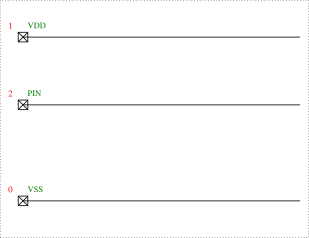
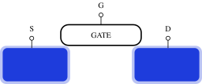
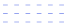
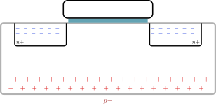
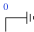
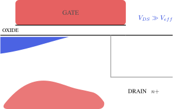

# Domain libraries

<!-- Generated by scripts/gen_lib_docs.py - edit the library
.tex files and re-run, not this file. -->

Beyond the [schematic vocabulary](symbols.md), the package ships
eleven domain libraries, inlined by `wrap_body` alongside
`cictikz_lib` (macro names are unique across all twelve).
Specimens below are auto-rendered with guessed arguments; macros
without an image only make sense composed into a larger figure.

## boot — the bootstrapped switch

> The bootstrapped switch, shared by l5_sw2 and l5_sw3.
> l5_sw2 shows one of them next to a bulk switched transmission gate;
> l5_sw3 shows two of them driving a differential pair with cross coupled
> dummies. It is the same drawing all three times, so it lives here and the
> figures inherit identical geometry.
> How it works. In phase c-bar the capacitor is strapped between ground and
> V_DD and charges to the supply, while the gate is held at ground and the
> switch is off. In phase c the bottom plate follows A and the top plate is
> handed to the gate, so V_GS = V_DD whatever A does. That is the point: the
> on resistance no longer depends on the signal.
> \bootBlockDn is the same block drawn below its rail rather than above it.
> l5_sw3 needs it: with both halves pointing the same way the lower network
> sits in the middle of the figure and the wires to the dummies have nowhere
> to run, which is what makes the original crowded.
> Every name is prefixed. Short generic names collide with LaTeX built-ins --
> \th is thorn -- and the redefinition is fatal, not a warning.

### bootSwH

`\bootSwH{...}{...}{...}`

### bootSwHd

`\bootSwHd{...}{...}{...}`

### bootSwD

`\bootSwD{...}{...}{...}`

### bootSwU

`\bootSwU{...}{...}{...}`

### bootGndL

`\bootGndL{...}{...}`

### bootGndR

`\bootGndR{...}{...}`

### bootGndD

`\bootGndD{...}{...}`

### bootPort

`\bootPort{...}{...}{...}`

### bootBlock

`\bootBlock{...}`

### bootBlockDn

`\bootBlockDn{...}`

## constellation — modulation constellations

> Constellation diagrams for the modulation section of the radio
> chapter.
> Every one of these is the same picture with different dots on it: a
> real and an imaginary axis, tick marks at +/-1, and a symbol at each
> point the modulator can produce. Keeping the frame in one macro means
> the four diagrams are actually comparable, which is the whole reason
> the chapter shows them one after another.
> \constframe{<half-width>}  draws the axes and their labels.
> \constsymbol{re}{im}       marks one symbol.
> \constcircle{r}            the unit circle, for the phase-only schemes.

### constframe

`\constframe{...}`

### constsymbol

`\constsymbol{...}{...}`

### constcircle

`\constcircle{...}`

## dacsm — DAC state machines

> The bubble-and-arrow language the four l04_dac coding slides share:
> dac_bin_states, dac_bin_btran, dac_thermo_states and dac_thermo_tran.
> The originals draw plain circles with the code inside and straight arrows
> between them, with the two directions of a pair drawn side by side rather
> than as one double-headed arrow. \dacEdge offsets each arrow off the centre
> line so a pair reads as two arrows.

### dacState

`\dacState{...}{...}{...}`

### dacStateWide

`\dacStateWide{...}{...}{...}`

### dacEdge

`\dacEdge{...}{...}`

### dacArrow

`\dacArrow{...}{...}`

## esd — ESD networks and zaps

> Shared frame for the ESD build-up sequence in l02_esd.
> Four figures in the chapter are the same picture with more added each
> time: a chip outline with three rails brought out to pads, then one
> diode, then two, then the whole network with the grounded gate NMOS.
> They only teach anything if they are literally the same drawing, so
> the frame lives here and each figure adds its own devices.
> Coordinates: pads at x = 0, rails run to \esdRight. VDD at \esdVdd,
> the signal pin at \esdPin, VSS at zero.
> The band between VSS and the pin has to hold a device, the gate
> resistor beside it and a two line caption above it, which is what
> sets \esdPin. The hand drawing these figures replace put every
> device in that one band with the captions in a row above them, and
> that is worth keeping: it is what lets the eye read the network as
> one row of paths rather than four scattered symbols.

Constants: `\esdVdd` = 5.8, `\esdPin` = 3.4, `\esdRight` = 9.8, `\esdLow` = 1.7, `\esdCap` = 2.45

### esdPadAt

`\esdPadAt{...}{...}`

### esdPad

`\esdPad{...}`

### esdframe

`\esdframe`

### esdDiode

`\esdDiode{...}{...}{...}{...}{...}`

### esdggn

`\esdggn{...}{...}{...}{...}{...}{...}`

### esdZapIn

`\esdZapIn{...}`

### esdZapOut

`\esdZapOut{...}`

## gmc — gm-C filter blocks

> Shared pieces for the l04_afe Gm-C cell figures.
> l4_gmc, l4_gmc_diff, l4_gmc_diff1 and l4_gmc1st all draw the
> transconductor the same way the original artwork does: a trapezoid with a
> tall input edge carrying the two input terminals and a short output edge.
> They are consecutive slides making the same point four ways, so they have
> to be on one geometry.
> l4_gmc_diff and l4_gmc_diff1 differ only in the output terminal marks and
> in which way the two G_m V_i arrows point -- that difference is the whole
> slide -- so \gmcDiffFrame draws everything else and leaves those to the
> caller, the same way sc_lib's \scIntroFrame does.
> Every name is prefixed and every macro name is letters only: TeX reads
> \gmcC1 as \gmcC followed by a stray 1, and fails at use rather than at
> definition.  Computed coordinates are wrapped in braces, because TikZ
> scans a coordinate for its closing parenthesis and a '(' inside the
> expression ends it early.

Constants: `\gmcW` = 1.5, `\gmcHi` = 1.5, `\gmcHo` = 0.8

### gmcBody

`\gmcBody{...}{...}{...}`

### gmcBodyL

`\gmcBodyL{...}{...}{...}`

### gmcPlus

`\gmcPlus{...}{...}`

### gmcMinus

`\gmcMinus{...}{...}`

### gmcVcap

`\gmcVcap{...}{...}{...}`

### gmcHcap

`\gmcHcap{...}{...}{...}`

### gmcDiffFrame

`\gmcDiffFrame`

## mos — MOSFET cross-section cartoons

> Shared pieces for the lr0_mosfet cross-section cartoons.
> Two families use this file:
> - the field-effect intro (mosfet_off/subthreshold/strong_inversion...):
> white background, glowing blue n+ blocks, gate box, S/G/D terminals
> - the carrier cartoons (accumulated/depleted/weakinv/vds_*): gray
> substrate, n+ boxes with blue minus signs, red plus signs in the
> p- bulk, teal oxide strip under the gate
> The colour language follows the original hand drawings: free electrons
> are blue, holes are red, the lecture prose ("imagine the free electrons
> as a blue fluorescent color") depends on it.

### fetblock

`\fetblock{...}{...}`

### fetterminal

`\fetterminal{...}{...}{...}`

### fetframe

`\fetframe`

### eminus

`\eminus{...}{...}`

### hplus

`\hplus{...}{...}`

### efill

`\efill{...}{...}`

### bulkframe

`\bulkframe`

### neckrow

`\neckrow{...}{...}`

### sideholes

`\sideholes`

### bulkterminalgnd

`\bulkterminalgnd{...}{...}{...}`

### drainzoomframe

`\drainzoomframe`

## plane — s/z-plane diagrams

> Shared pieces for the l05_sc s-plane and z-plane diagrams.
> l5_sdomain, l5_zdomain and l5_zunstable are the same pair of axes with
> different things marked on them, and the lecture walks from one to the next.
> Keeping the axes, the unit circle and the pole marker here means the three
> slides line up and a reader can see what changed.
> Pole and zero positions are given in units of the unit circle radius, so
> (0.5,0.3) means half a radius out. The macros scale by \planeR.
> Every name is prefixed: short generic names collide with LaTeX built-ins.

Constants: `\planeR` = 1.8, `\planeXmax` = 3.1, `\planeYmax` = 2.9, `\planeMark` = 0.17

### planeAxes

`\planeAxes{...}{...}`

### planeCircle

`\planeCircle`

### planePole

`\planePole{...}{...}{...}`

### planeZero

`\planeZero{...}{...}{...}`

## rdac — resistor-DAC blocks

> Shared pieces for the resistor-string DAC figures in l04_dac:
> dac_r_div, dac_r_div2 and dac_r_div2b are the same drawing with one, two
> and four resistors, so the switch and the terminal live here and the
> figures only place them.
> The originals draw the switches as bare NMOS symbols with the control on
> the gate stub above, so that is what \rdacSw draws: a device on a
> left-to-right path, which puts the gate on top.

### rdacVgnd

`\rdacVgnd{...}`

### rdacSpdt

`\rdacSpdt{...}{...}{...}{...}`

### rdacAmp

`\rdacAmp{...}{...}`

### rdacPort

`\rdacPort{...}{...}{...}`

### rdacSw

`\rdacSw{...}{...}{...}{...}`

## sc — switched-capacitor circuits

> Shared pieces for the l05_sc switched-capacitor amplifier figures.
> l5_scintro1 and l5_scintro2 are the same circuit in its two clock phases,
> and the lecture's whole charge-conservation argument works by comparing
> them. They therefore have to be drawn on identical geometry, which is what
> \scIntroFrame is for: it draws everything the two share and leaves the two
> switch positions to the caller, since those are exactly what differs.
> Every name is prefixed: short generic names collide with LaTeX built-ins.
> Names are letters only -- TeX macro names cannot contain digits, so \scXc2
> parses as \scXc followed by a 2 and fails at use, not at definition.

Constants: `\scYgnd` = 0, `\scYin` = 1.8, `\scXota` = 4.6, `\scXctwo` = 4.0, `\scYctwo` = 3.8, `\scYsh` = 4.8, `\scXshr` = 6.6, `\scXout` = 7.6, `\scAmpYctwo` = 3.8, `\scAmpYrst` = 4.9, `\scAmpXrl` = 4.9, `\scAmpXrr` = 6.9, `\scWavT` = 1.2, `\scWavVi` = 0.85, `\scWavClk` = -1.25, `\scWavClkH` = 0.55

### scSwOpen

`\scSwOpen{...}{...}`

### scSwClosed

`\scSwClosed{...}{...}`

### scIntroFrame

`\scIntroFrame`

### scSwH

`\scSwH{...}{...}{...}`

### scSwV

`\scSwV{...}{...}{...}`

### scPort

`\scPort{...}{...}{...}`

### scAmpFrame

`\scAmpFrame`

### scWaveEdge

`\scWaveEdge{...}{...}{...}{...}`

### scWaveFrame

`\scWaveFrame{...}`

## sfg — signal-flow and block diagrams

> Shared pieces for the l04_afe signal flow graphs, l4_first_order and
> l4_biquad.  The biquad is meant to read as the first-order graph with a
> second integrator added, so the summing node and the 1/s block have to be
> the same size and shape in both.  They are the same size in the original
> artwork too.
> Names are prefixed and letters only, and computed coordinates are braced:
> TikZ scans a coordinate for its closing parenthesis, so a '(' inside an
> expression ends it early.

Constants: `\sfgR` = 0.25, `\sfgBw` = 1.0, `\sfgBh` = 0.65

### sfgSum

`\sfgSum{...}{...}`

### sfgBox

`\sfgBox{...}{...}{...}`

### sfgDot

`\sfgDot{...}{...}`

### sfgMix

`\sfgMix{...}{...}`

### sfgAmp

`\sfgAmp{...}{...}{...}`

### sfgAntenna

`\sfgAntenna{...}{...}`

### sfgTall

`\sfgTall{...}{...}{...}{...}{...}`

## spec — spectra sketches

> Shared pieces for the l05_sc sampling spectra.
> l5_sh, l5_shaaf and l5_subsample are the same drawing three times: no
> filter, an anti-alias low pass, and a bandpass around f_s. The slides make
> their point by looking alike, so the axis, the wanted signal and the tones
> all come from here and every figure inherits the same geometry.
> Every name is prefixed. \th is a LaTeX built-in and redefining it is a
> fatal error, so short generic names are not safe.

Constants: `\specHalf` = 1.2, `\specXmax` = 3.5, `\specVh` = 1.9, `\specToneH` = 1.05, `\specSkirt` = 0.20, `\specYtop` = 3.9, `\specYbot` = 0

### specAxis

`\specAxis{...}`

### specBump

`\specBump{...}`

### specTone

`\specTone{...}{...}{...}`

### specBand

`\specBand{...}{...}{...}{...}`

### specBlock

`\specBlock{...}{...}{...}`

### specWire

`\specWire{...}{...}{...}`

