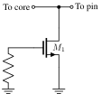
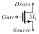
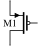
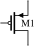
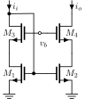
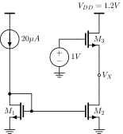

# Symbol library

<!-- Generated by scripts/gen_symbol_docs.py - edit the symbol
YAML (via scripts/gen_symbols.py) and re-run, not this file. -->

All coordinates are figure units (`\grid` = 1.6, one transistor
tall, y up) relative to the macro entry point. Macros are path
fragments: they start at the current point and compose inside one
`\draw`. Every rendering below is produced by the macro itself,
so this page doubles as a compile test of the library.

| symbol | description |
|---|---|
| [`\anaQuestion`](#anaquestion) | Current mirror bias question figure (M1-M3 with sources) |
| [`\cicAdd`](#cicadd) | Summing node: circle with + |
| [`\cicH`](#cich) | Transfer-function box H(s) |
| [`\cicOta`](#cicota) | Fully differential OTA outline (triangle, +/- in, -/+ out). Exports coordinates cicOta_inp/inn/outp/outn; path returns to inp. |
| [`\cicOtaSSWP`](#cicotasswp) | Single-ended OTA outline with caller-set input labels |
| [`\cicOtaSWP`](#cicotaswp) | Fully differential OTA outline with caller-set port labels (+in/-in/+out/-out) |
| [`\cmCascode`](#cmcascode) | Cascoded NMOS current mirror (M1-M4, v_b bias port), grounds included. Branches at x=0 and x=2.5, tops at y=3.7. Path returns to entry. |
| [`\cmRCascode`](#cmrcascode) | Cascode mirror with resistor-derived cascode bias |
| [`\cmSfCascode`](#cmsfcascode) | Cascode current mirror biased as source follower (M3/M4 under M1/M2) |
| [`\cmSourceDeg`](#cmsourcedeg) | Source-degenerated current mirror (R_s under M1/M2), grounds included |
| [`\cmStd`](#cmstd) | Standard NMOS current mirror (M1 diode-connected, M2 output), grounds included, current arrows i_i/i_o. Path returns to entry. |
| [`\curDown`](#curdown) | Downward current arrow on a half-grid stub |
| [`\esdGgnmos`](#esdggnmos) | Grounded-gate NMOS ESD clamp with gate resistor |
| [`\filtActLP`](#filtactlp) | Active RC low-pass: R into OTA virtual ground, C in feedback |
| [`\filtActZ`](#filtactz) | Active filter with generic input/feedback impedances |
| [`\filtHP`](#filthp) | Passive RC high-pass: series C to shunt R |
| [`\filtLP`](#filtlp) | Passive RC low-pass: series R to shunt C |
| [`\hcapacitor`](#hcapacitor) | Capacitor, horizontal |
| [`\himpedance`](#himpedance) | Generic impedance box, horizontal |
| [`\hinv`](#hinv) | Inverter (not port), horizontal, input left output right |
| [`\hresistor`](#hresistor) | Resistor, horizontal (hand-rolled zig-zag) |
| [`\lvmnmos`](#lvmnmos) | NMOS transistor, vertical, drain up, gate on the right (mirrored), with optional gate input port; gate pin is the end of the gate lead |
| [`\lvmpmos`](#lvmpmos) | PMOS transistor, vertical, source up, gate on the right (mirrored), with optional gate input port; gate pin is the end of the gate lead |
| [`\lvnmos`](#lvnmos) | NMOS transistor, vertical, drain up, gate on the left, with optional gate input port; gate pin is the end of the gate lead |
| [`\lvpmos`](#lvpmos) | PMOS transistor, vertical, source up, gate on the left, with optional gate input port; gate pin is the end of the gate lead |
| [`\portCurDown`](#portcurdown) | Downward current arrow with a label |
| [`\portDiffIn`](#portdiffin) | Differential input port pair (+ over -, 1.6 apart) |
| [`\portDiffOut`](#portdiffout) | Differential output port pair (+ over -, 1.6 apart) |
| [`\portIn`](#portin) | Input port: open circle at the current point, label to the left (anchor east) |
| [`\portOut`](#portout) | Output port: junction dot at entry, 0.5 wire right, open circle, label right |
| [`\portOutDown`](#portoutdown) | Output port drawn downward half a grid |
| [`\portmIn`](#portmin) | Input port, mirrored: label to the right (anchor west), for mirrored devices |
| [`\trNmos`](#trnmos) | NMOS with labelled Gate/Drain/Source terminals (teaching figure) |
| [`\vcapacitor`](#vcapacitor) | Capacitor, vertical |
| [`\vground`](#vground) | Ground symbol (three shrinking bars, downward). Path returns to entry. |
| [`\vimpedance`](#vimpedance) | Generic impedance box, vertical |
| [`\vmnmos`](#vmnmos) | NMOS transistor, vertical, drain up, gate on the right (mirrored); gate pin is the end of the gate lead |
| [`\vmpmos`](#vmpmos) | PMOS transistor, vertical, source up, gate on the right (mirrored); gate pin is the end of the gate lead |
| [`\vnmos`](#vnmos) | NMOS transistor, vertical, drain up, gate on the left; gate pin is the end of the gate lead |
| [`\vpmos`](#vpmos) | PMOS transistor, vertical, source up, gate on the left; gate pin is the end of the gate lead |
| [`\vresistor`](#vresistor) | Resistor, vertical (hand-rolled zig-zag, weight-matched to wires) |
| [`\vsupply`](#vsupply) | Supply symbol (upward stub with slash). Path returns to entry. |
| [`\vvsource`](#vvsource) | Voltage source, vertical, drawn DOWNWARD 1.5 grid from entry |


## Transistors

### esdGgnmos



Grounded-gate NMOS ESD clamp with gate resistor

```latex
\esdGgnmos
```

entry `[0, 0]` — exit `[0, 0]`

| pin | position | direction |
|---|---|---|
| pin | [0.5, 3.2] | inout |
| core | [-1, 3.2] | inout |

exported coordinates: `esdStart`, `cStart`, `esdRbot`, `top`

```latex
\draw (0,0) \esdGgnmos;
```

### lvmnmos


NMOS transistor, vertical, drain up, gate on the right (mirrored), with optional gate input port; gate pin is the end of the gate lead

```latex
\lvmnmos{instance name (becomes circuitikz node, e.g. M1)}{gate port label, e.g. $v_i$ (empty {} suppresses the port)}
```

entry `[0, 0]` — exit `[0, 1.6]`

| pin | position | direction |
|---|---|---|
| drain | [0, 1.6] | inout |
| gate | [0.98, 0.8] | in |
| source | [0, 0] | inout |

anchors: `<inst>.drain`, `<inst>.gate`, `<inst>.source`, `<inst>.bulk`

exported coordinates: `cicmos`

xschem: `sky130_fd_pr/nfet_01v8.sym`

```latex
\draw (0,0) \vground \lvmnmos{M1}{$v_i$};
```

### lvmpmos


PMOS transistor, vertical, source up, gate on the right (mirrored), with optional gate input port; gate pin is the end of the gate lead

```latex
\lvmpmos{instance name (becomes circuitikz node, e.g. M1)}{gate port label, e.g. $v_i$ (empty {} suppresses the port)}
```

entry `[0, 0]` — exit `[0, 1.6]`

| pin | position | direction |
|---|---|---|
| source | [0, 1.6] | inout |
| gate | [0.98, 0.8] | in |
| drain | [0, 0] | inout |

anchors: `<inst>.drain`, `<inst>.gate`, `<inst>.source`, `<inst>.bulk`

exported coordinates: `cicmos`

xschem: `sky130_fd_pr/pfet_01v8.sym`

```latex
\draw (0,0) \vground \lvmpmos{M1}{$v_i$};
```

### lvnmos


NMOS transistor, vertical, drain up, gate on the left, with optional gate input port; gate pin is the end of the gate lead

```latex
\lvnmos{instance name (becomes circuitikz node, e.g. M1)}{gate port label, e.g. $v_i$ (empty {} suppresses the port)}
```

entry `[0, 0]` — exit `[0, 1.6]`

| pin | position | direction |
|---|---|---|
| drain | [0, 1.6] | inout |
| gate | [-0.98, 0.8] | in |
| source | [0, 0] | inout |

anchors: `<inst>.drain`, `<inst>.gate`, `<inst>.source`, `<inst>.bulk`

exported coordinates: `cicmos`

xschem: `sky130_fd_pr/nfet_01v8.sym`

```latex
\draw (0,0) \vground \lvnmos{M1}{$v_i$};
```

### lvpmos


PMOS transistor, vertical, source up, gate on the left, with optional gate input port; gate pin is the end of the gate lead

```latex
\lvpmos{instance name (becomes circuitikz node, e.g. M1)}{gate port label, e.g. $v_i$ (empty {} suppresses the port)}
```

entry `[0, 0]` — exit `[0, 1.6]`

| pin | position | direction |
|---|---|---|
| source | [0, 1.6] | inout |
| gate | [-0.98, 0.8] | in |
| drain | [0, 0] | inout |

anchors: `<inst>.drain`, `<inst>.gate`, `<inst>.source`, `<inst>.bulk`

exported coordinates: `cicmos`

xschem: `sky130_fd_pr/pfet_01v8.sym`

```latex
\draw (0,0) \vground \lvpmos{M1}{$v_i$};
```

### trNmos



NMOS with labelled Gate/Drain/Source terminals (teaching figure)

```latex
\trNmos
```

entry `[0, 0]` — exit `[0, 0]`

| pin | position | direction |
|---|---|---|
| drain | [0, 1.6] | inout |
| gate | [-0.98, 0.8] | in |
| source | [0, 0] | inout |

exported coordinates: `cStart`

```latex
\draw (0,0) \trNmos;
```

### vmnmos


NMOS transistor, vertical, drain up, gate on the right (mirrored); gate pin is the end of the gate lead

```latex
\vmnmos{instance name (becomes circuitikz node, e.g. M1)}
```

entry `[0, 0]` — exit `[0, 1.6]`

| pin | position | direction |
|---|---|---|
| drain | [0, 1.6] | inout |
| gate | [0.98, 0.8] | in |
| source | [0, 0] | inout |

anchors: `<inst>.drain`, `<inst>.gate`, `<inst>.source`, `<inst>.bulk`

xschem: `sky130_fd_pr/nfet_01v8.sym`

```latex
\draw (0,0) \vground \vmnmos{M1};
```

### vmpmos



PMOS transistor, vertical, source up, gate on the right (mirrored); gate pin is the end of the gate lead

```latex
\vmpmos{instance name (becomes circuitikz node, e.g. M1)}
```

entry `[0, 0]` — exit `[0, 1.6]`

| pin | position | direction |
|---|---|---|
| source | [0, 1.6] | inout |
| gate | [0.98, 0.8] | in |
| drain | [0, 0] | inout |

anchors: `<inst>.drain`, `<inst>.gate`, `<inst>.source`, `<inst>.bulk`

xschem: `sky130_fd_pr/pfet_01v8.sym`

```latex
\draw (0,0) \vground \vmpmos{M1};
```

### vnmos


NMOS transistor, vertical, drain up, gate on the left; gate pin is the end of the gate lead

```latex
\vnmos{instance name (becomes circuitikz node, e.g. M1)}
```

entry `[0, 0]` — exit `[0, 1.6]`

| pin | position | direction |
|---|---|---|
| drain | [0, 1.6] | inout |
| gate | [-0.98, 0.8] | in |
| source | [0, 0] | inout |

anchors: `<inst>.drain`, `<inst>.gate`, `<inst>.source`, `<inst>.bulk`

xschem: `sky130_fd_pr/nfet_01v8.sym`

```latex
\draw (0,0) \vground \vnmos{M1};
```

### vpmos



PMOS transistor, vertical, source up, gate on the left; gate pin is the end of the gate lead

```latex
\vpmos{instance name (becomes circuitikz node, e.g. M1)}
```

entry `[0, 0]` — exit `[0, 1.6]`

| pin | position | direction |
|---|---|---|
| source | [0, 1.6] | inout |
| gate | [-0.98, 0.8] | in |
| drain | [0, 0] | inout |

anchors: `<inst>.drain`, `<inst>.gate`, `<inst>.source`, `<inst>.bulk`

xschem: `sky130_fd_pr/pfet_01v8.sym`

```latex
\draw (0,0) \vground \vpmos{M1};
```


## Passives

### hcapacitor


Capacitor, horizontal

```latex
\hcapacitor{value label, e.g. $R_s$}
```

entry `[0, 0]` — exit `[1.6, 0]`

| pin | position | direction |
|---|---|---|
| minus | [0, 0] | inout |
| plus | [1.6, 0] | inout |

exported coordinates: `cStart`, `capEnd`

xschem: `devices/capa.sym`

```latex
\draw (0,0) \hcapacitor{$Z$};
```

### himpedance


Generic impedance box, horizontal

```latex
\himpedance{value label, e.g. $R_s$}
```

entry `[0, 0]` — exit `[1.6, 0]`

| pin | position | direction |
|---|---|---|
| minus | [0, 0] | inout |
| plus | [1.6, 0] | inout |

exported coordinates: `cStart`, `impEnd`

```latex
\draw (0,0) \himpedance{$Z$};
```

### hresistor


Resistor, horizontal (hand-rolled zig-zag)

```latex
\hresistor{value label, e.g. $R_s$}
```

entry `[0, 0]` — exit `[1.6, 0]`

| pin | position | direction |
|---|---|---|
| minus | [0, 0] | inout |
| plus | [1.6, 0] | inout |

exported coordinates: `cStart`, `resEnd`

xschem: `devices/res.sym`

```latex
\draw (0,0) \hresistor{$Z$};
```

### vcapacitor


Capacitor, vertical

```latex
\vcapacitor{value label, e.g. $R_s$}
```

entry `[0, 0]` — exit `[0, 1.6]`

| pin | position | direction |
|---|---|---|
| minus | [0, 0] | inout |
| plus | [0, 1.6] | inout |

exported coordinates: `cStart`, `capEnd`

xschem: `devices/capa.sym`

```latex
\draw (0,0) \vcapacitor{$Z$};
```

### vimpedance


Generic impedance box, vertical

```latex
\vimpedance{value label, e.g. $R_s$}
```

entry `[0, 0]` — exit `[0, 1.6]`

| pin | position | direction |
|---|---|---|
| minus | [0, 0] | inout |
| plus | [0, 1.6] | inout |

exported coordinates: `cStart`, `impEnd`

```latex
\draw (0,0) \vimpedance{$Z$};
```

### vresistor


Resistor, vertical (hand-rolled zig-zag, weight-matched to wires)

```latex
\vresistor{value label, e.g. $R_s$}
```

entry `[0, 0]` — exit `[0, 1.6]`

| pin | position | direction |
|---|---|---|
| minus | [0, 0] | inout |
| plus | [0, 1.6] | inout |

exported coordinates: `cStart`, `resEnd`

xschem: `devices/res.sym`

```latex
\draw (0,0) \vresistor{$Z$};
```


## Sources and rails

### vground


Ground symbol (three shrinking bars, downward). Path returns to entry.

```latex
\vground
```

entry `[0, 0]` — exit `[0, 0]`

| pin | position | direction |
|---|---|---|
| term | [0, 0] | supply |

exported coordinates: `cStart`

xschem: `devices/gnd.sym`

```latex
\draw (0,0) \vground \vresistor{$R$};
```

### vsupply


Supply symbol (upward stub with slash). Path returns to entry.

```latex
\vsupply
```

entry `[0, 0]` — exit `[0, 0]`

| pin | position | direction |
|---|---|---|
| term | [0, 0] | supply |

exported coordinates: `vSupplyStart`

xschem: `devices/vdd.sym`

```latex
\draw (M3.drain) \vsupply;
```

### vvsource


Voltage source, vertical, drawn DOWNWARD 1.5 grid from entry

```latex
\vvsource{source label, e.g. $V_{DD}$}
```

entry `[0, 0]` — exit `[0, -2.4]`

| pin | position | direction |
|---|---|---|
| plus | [0, 0] | inout |
| minus | [0, -2.4] | inout |

xschem: `devices/vsource.sym`

```latex
\draw (0,0) \vvsource{$V_{DD}$} \vground;
```


## Ports

### curDown


Downward current arrow on a half-grid stub

```latex
\curDown{current label}
```

entry `[0, 0]` — exit `[0, -0.8]`

| pin | position | direction |
|---|---|---|
| term | [0, 0] | inout |

```latex
\draw (0,0) \curDown{x};
```

### portCurDown


Downward current arrow with a label

```latex
\portCurDown{current label}
```

entry `[0, 0]` — exit `[0, -0.8]`

| pin | position | direction |
|---|---|---|
| term | [0, 0] | inout |

```latex
\draw (0,0) \portCurDown{x};
```

### portDiffIn


Differential input port pair (+ over -, 1.6 apart)

```latex
\portDiffIn{port label}
```

entry `[0, 0]` — exit `[0, 0]`

| pin | position | direction |
|---|---|---|
| plus | [0, 0] | in |
| minus | [0, -1.6] | in |

exported coordinates: `cStart`

```latex
\draw (0,0) \portDiffIn{x};
```

### portDiffOut


Differential output port pair (+ over -, 1.6 apart)

```latex
\portDiffOut{port label}
```

entry `[0, 0]` — exit `[0, 0]`

| pin | position | direction |
|---|---|---|
| plus | [0.5, 0] | out |
| minus | [0.5, -1.6] | out |

exported coordinates: `cStart`

```latex
\draw (0,0) \portDiffOut{x};
```

### portIn


Input port: open circle at the current point, label to the left (anchor east)

```latex
\portIn{port label, e.g. $v_i$}
```

entry `[0, 0]` — exit `[0, 0]`

| pin | position | direction |
|---|---|---|
| term | [0, 0] | in |

xschem: `devices/ipin.sym`

```latex
\draw (M1.gate) \portIn{$v_i$};
```

### portOut


Output port: junction dot at entry, 0.5 wire right, open circle, label right

```latex
\portOut{port label, e.g. $v_o$}
```

entry `[0, 0]` — exit `[0.5, 0]`

| pin | position | direction |
|---|---|---|
| term | [0, 0] | out |

xschem: `devices/opin.sym`

```latex
\draw (M1.drain) \portOut{$v_o$};
```

### portOutDown


Output port drawn downward half a grid

```latex
\portOutDown{port label}
```

entry `[0, 0]` — exit `[0, -0.8]`

| pin | position | direction |
|---|---|---|
| term | [0, 0] | out |

exported coordinates: `cStart`

```latex
\draw (0,0) \portOutDown{x};
```

### portmIn


Input port, mirrored: label to the right (anchor west), for mirrored devices

```latex
\portmIn{port label}
```

entry `[0, 0]` — exit `[0, 0]`

| pin | position | direction |
|---|---|---|
| term | [0, 0] | in |

xschem: `devices/ipin.sym`

```latex
\draw (M2.gate) \portmIn{$v_b$};
```


## OTAs and blocks

### cicAdd


Summing node: circle with +

```latex
\cicAdd
```

entry `[0, 0]` — exit `[0.4, 0]`

| pin | position | direction |
|---|---|---|
| in | [0, 0] | in |
| out | [0.4, 0] | out |

```latex
\draw (0,0) \cicAdd;
```

### cicH


Transfer-function box H(s)

```latex
\cicH{box label}
```

entry `[0, 0]` — exit `[0.8, 0]`

| pin | position | direction |
|---|---|---|
| in | [0, 0] | in |
| out | [0.8, 0] | out |

```latex
\draw (0,0) \cicH{x};
```

### cicOta


Fully differential OTA outline (triangle, +/- in, -/+ out). Exports coordinates cicOta_inp/inn/outp/outn; path returns to inp.

```latex
\cicOta
```

entry `[0, 0]` — exit `[0, 0]`

| pin | position | direction |
|---|---|---|
| inp | [0, 0] | in |
| inn | [0, -1.6] | in |
| outp | [2.6, -1.6] | out |
| outn | [2.6, 0] | out |

anchors: `cicOta_inp`, `cicOta_inn`, `cicOta_outp`, `cicOta_outn`

exported coordinates: `cicOta_inp`, `cicOta_inn`, `cicOta_outp`, `cicOta_outn`

```latex
\draw (0,0) \cicOta;
\draw (cicOta_inp) \portIn{$v_{ip}$};
\draw (cicOta_outn) \portOut{$v_{on}$};
```

### cicOtaSSWP


Single-ended OTA outline with caller-set input labels

```latex
\cicOtaSSWP{+in label}{-in label}
```

entry `[0, 0]` — exit `[0, 0]`

| pin | position | direction |
|---|---|---|
| inp | [0, 0] | in |
| inn | [0, -0.8] | in |
| out | [2.6, -0.4] | out |

exported coordinates: `cicOtaS_inp`, `cicOtaS_inn`, `cicOtaS_out`

```latex
\draw (0,0) \cicOtaSSWP{x}{x};
```

### cicOtaSWP


Fully differential OTA outline with caller-set port labels (+in/-in/+out/-out)

```latex
\cicOtaSWP{+in label}{-in label}{+out label}{-out label}
```

entry `[0, 0]` — exit `[0, 0]`

| pin | position | direction |
|---|---|---|
| inp | [0, 0] | in |
| inn | [0, -1.6] | in |
| outp | [2.6, -1.6] | out |
| outn | [2.6, 0] | out |

exported coordinates: `cicOta_inp`, `cicOta_inn`, `cicOta_outp`, `cicOta_outn`

```latex
\draw (0,0) \cicOtaSWP{x}{x}{x}{x};
```

### hinv


Inverter (not port), horizontal, input left output right

```latex
\hinv{instance name (becomes the not-port node, e.g. X1)}
```

entry `[0, 0]` — exit `[1.4, 0]`

| pin | position | direction |
|---|---|---|
| in | [0, 0] | in |
| out | [1.4, 0] | out |

anchors: `<inst>.in 1`, `<inst>.out`

```latex
\draw (0,0) \hinv{X1};
```


## Current mirrors

### cmCascode



Cascoded NMOS current mirror (M1-M4, v_b bias port), grounds included. Branches at x=0 and x=2.5, tops at y=3.7. Path returns to entry.

```latex
\cmCascode
```

entry `[0, 0]` — exit `[0, 0]`

| pin | position | direction |
|---|---|---|
| in | [0, 3.7] | in |
| out | [2.5, 3.7] | out |

anchors: `mn1.gate`, `mn2.gate`, `mn3.gate`, `mn4.gate`, `mn3.drain`

exported coordinates: `cStart`

```latex
\draw (0,0) \cmCascode;
```

### cmRCascode


Cascode mirror with resistor-derived cascode bias

```latex
\cmRCascode
```

entry `[0, 0]` — exit `[0, 0]`

| pin | position | direction |
|---|---|---|
| in | [0, 5.3] | in |
| out | [2.5, 3.7] | out |

exported coordinates: `cmRStart`, `cStart`, `resCon`, `resEnd`

```latex
\draw (0,0) \cmRCascode;
```

### cmSfCascode


Cascode current mirror biased as source follower (M3/M4 under M1/M2)

```latex
\cmSfCascode
```

entry `[0, 0]` — exit `[0, 0]`

| pin | position | direction |
|---|---|---|
| in | [0, 3.7] | in |
| out | [2, 3.7] | out |

exported coordinates: `cStart`

```latex
\draw (0,0) \cmSfCascode;
```

### cmSourceDeg


Source-degenerated current mirror (R_s under M1/M2), grounds included

```latex
\cmSourceDeg
```

entry `[0, 0]` — exit `[0, 0]`

| pin | position | direction |
|---|---|---|
| in | [0, 3.7] | in |
| out | [2, 3.7] | out |

exported coordinates: `cStart`

```latex
\draw (0,0) \cmSourceDeg;
```

### cmStd


Standard NMOS current mirror (M1 diode-connected, M2 output), grounds included, current arrows i_i/i_o. Path returns to entry.

```latex
\cmStd
```

entry `[0, 0]` — exit `[0, 0]`

| pin | position | direction |
|---|---|---|
| in | [0, 2.1] | in |
| out | [2.0, 2.1] | out |

anchors: `mn1.gate`, `mn1.drain`, `mn2.gate`, `mn2.drain`

exported coordinates: `cStart`

```latex
\draw (0,0) \cmStd;
```


## Filters

### filtActLP


Active RC low-pass: R into OTA virtual ground, C in feedback

```latex
\filtActLP{R label}{C label}
```

entry `[0, 0]` — exit `[4.2, 0]`

| pin | position | direction |
|---|---|---|
| in | [0, 0] | in |
| out | [4.2, 0] | out |

exported coordinates: `cicStart`, `resEnd`, `capEnd`, `cStart`, `cicOta_inp`, `cicOta_inn`, `cicOta_outp`, `cicOta_outn`

```latex
\draw (0,0) \filtActLP{x}{x};
```

### filtActZ


Active filter with generic input/feedback impedances

```latex
\filtActZ{input Z label}{feedback Z label}
```

entry `[0, 0]` — exit `[4.2, 0]`

| pin | position | direction |
|---|---|---|
| in | [0, 0] | in |
| out | [4.2, 0] | out |

exported coordinates: `cicStart`, `impEnd`, `cStart`, `cicOta_inp`, `cicOta_inn`, `cicOta_outp`, `cicOta_outn`

```latex
\draw (0,0) \filtActZ{x}{x};
```

### filtHP


Passive RC high-pass: series C to shunt R

```latex
\filtHP{C label}{R label}
```

entry `[0, 0]` — exit `[1.6, 0]`

| pin | position | direction |
|---|---|---|
| in | [0, 0] | in |
| out | [1.6, 0] | out |

exported coordinates: `cStart`, `capEnd`, `resEnd`

```latex
\draw (0,0) \filtHP{x}{x};
```

### filtLP


Passive RC low-pass: series R to shunt C

```latex
\filtLP{R label}{C label}
```

entry `[0, 0]` — exit `[1.6, 0]`

| pin | position | direction |
|---|---|---|
| in | [0, 0] | in |
| out | [1.6, 0] | out |

exported coordinates: `cStart`, `resEnd`, `capEnd`

```latex
\draw (0,0) \filtLP{x}{x};
```


## Other

### anaQuestion



Current mirror bias question figure (M1-M3 with sources)

```latex
\anaQuestion
```

entry `[0, 0]` — exit `[0, 0]`

exported coordinates: `cStart`

```latex
\draw (0,0) \anaQuestion;
```

